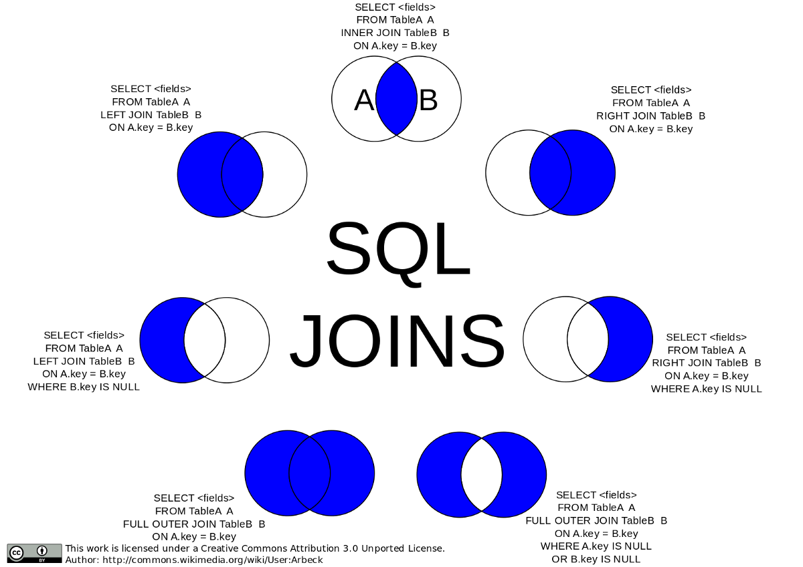

# Joins

## Querying From Multiple Tables



- `INNER JOIN` --> join what is common between two tables

- `RIGHT JOIN` --> join what is common between two tables and all the records from the right table

- `LEFT JOIN` --> join what is common between two tables and all the records from the left table

- `FULL JOIN` --> join everything

- ANTI JOIN --> join everything that is not in common (done with a `FULL JOIN` and nulls)

- `CROSS JOIN` --> multiplies number of rows in the first table with the number of rows in the second table (results in Cartesian Product)
  - if `WHERE` clause used with `CROSS JOIN` then it functions like an `INNER JOIN`

### Example (Customers Who Never Order - LeetCode):

Suppose that a website contains two tables, the Customers table and the Orders table. Write a SQL query to find all customers who never order anything.

Table: Customers
| ID      | Name |
| ----------- | ----------- |
| 1     | Joe       |
| 2  | Henry      |
| 3     | Sam       |
| 4  | Max        |

Table: Orders
| ID      | CustomerID |
| ----------- | ----------- |
| 1     | 3      |
| 2  | 1     |

Table: Expected Output
| Customers     | 
| ----------- | 
| Henry    |
| Max  | 

```
SELECT t1.Name as 'Customers' FROM Customers t1 
LEFT JOIN Orders t2 ON t2.CustomerID = t1.Id
WHERE t2.CustomerID IS NULL;
```

- use `AS` to change the column name
- create t1 from Customers and t2 from Orders
- `LEFT JOIN` Orders and Customers on CustomerID = ID
- but specify where CustomerID = NULL so we match customers who do not show up in the Orders table

